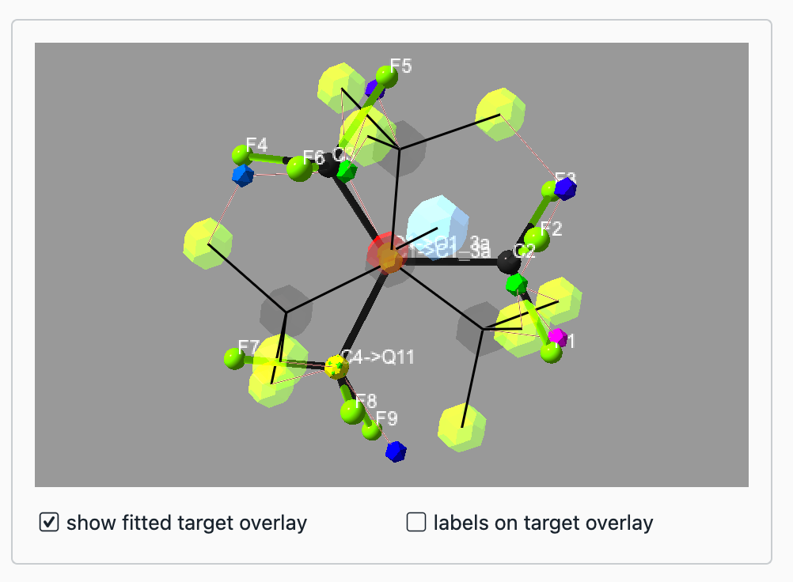
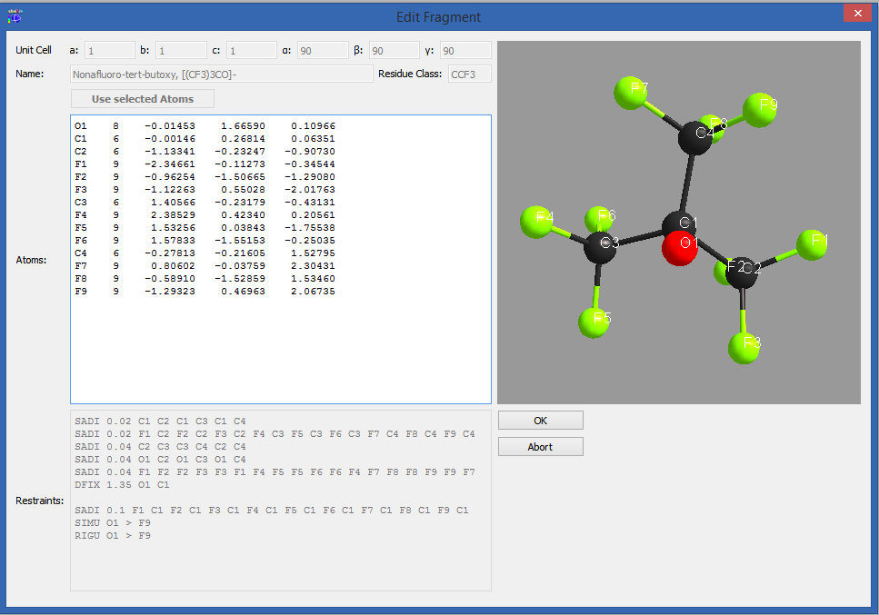
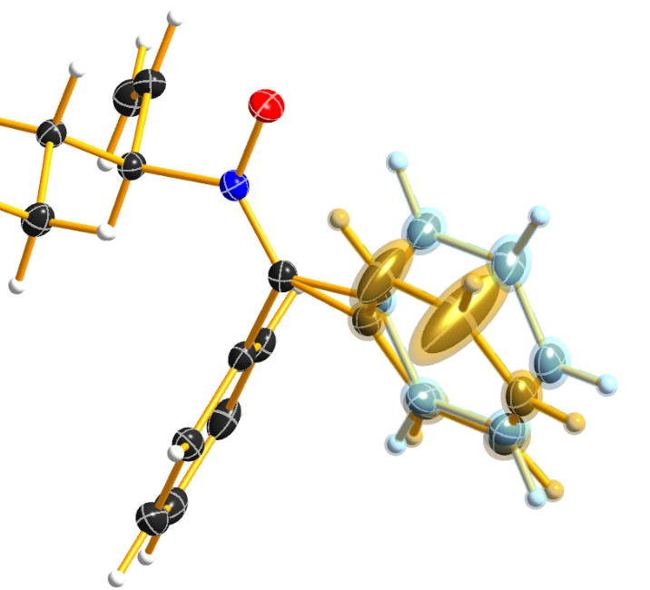

Preface
*******

The following user manual explains the usage of the program DSR. It
allows for a semi-automatic modelling of disordered moieties. Its
database contains molecular fragments and their corresponding restraints
as well as a fitting procedure to place these fragments on the desired
position in the unit cell.

The web page can be found at `<https://dkratzert.de/dsr.html>`_ and the
development platform at `<https://github.com/dkratzert/DSR>`_.

If you find any bugs in this program, have feature requests or just
comments; please don't hesitate to write an email to <dkratzert@gmx.de>
to report these.

Please cite DSR as:

D. Kratzert, J.J. Holstein, I. Krossing, *J. Appl. Cryst.*
**2015** *48*, 933-938.
`doi:10.1107/S1600576715005580 <http://scripts.iucr.org/cgi-bin/paper?S1600576715005580>`_

**Disclaimer**

You are responsible for the correctness of restraints applied to your
crystal structure. The restraints applied by DSR are only suggestions to
stabilize a first model. **DSR does not replace the judgment of an
expert.**

Program Overview
****************

The program-package consists of a simple text-database with fragments of
molecules and the DSR program itself. It acts as a preprocessor for
SHELXL .res files. The user has to insert a special command line in the
SHELXL .res file and the DSR program reads this information. The command
lines main purpose is to tell DSR, how to orient a molecular fragment
from the database in the unit cell. In practice, the user has to choose
a minimum of three target positions (atoms or Q-peaks) in the structure
and the corresponding atoms from the database fragment (source atoms)
that should be placed on the target positions.

You prefer Olex2? Then you might want to use
the `FragmentDB <https://www.xs3.uni-freiburg.de/research/fragmentdb>`_ plugin.
It is a port of DSR to Olex2.

Installation
************

Windows
=======

Execute the "DSR-setup-[version number].exe" and follow the
instructions.
DSR needs at least Windows 7 or Windows 10 for the latest version.
**If you install DSR the first time, a restart of Windows
might be necessary.**

Linux
=====

Either install DSR according to
the installation procedure of your LINUX distribution. Or install the
dsr-shelx package from `pypi.org <https://pypi.org/project/dsr-shelx/>`_.
DSR expects a shelxl or xl executable version 2013 or above in the
system path.

Since version 213, DSR needs the numpy package to be installed in order
to run.

The update from DSR for python 2.7 (version 236 and below) to DSR for Python 3
needs some manual work. You need to uninstall the old version and make sure the
files dsr.sh, dsr-mac and dsr-linux are removed from /etc/profile.d/ and/or
/etc/paths.d/.

MacOS
=====

Install the dsr-shelx package from `pypi.org <https://pypi.org/project/dsr-shelx/>`_.

The update from DSR for python 2.7 (version 236 and below) to DSR for Python 3
needs some manual work. You need to uninstall the old version and make sure the
files dsr.sh, dsr-mac and dsr-linux are removed from /etc/profile.d/ and/or
/etc/paths.d/.

User-defined database
=====================

DSR expects the database file "dsr_user_db.txt" with
self-made fragments in the user's home directory. The installation
procedures create an empty user database in the following directories if
no previous database exists:

Windows: C:\\users\\username\\

Linux: /home/username/

Mac OS X: /Users/username/

DSR in ShelXle
**************

Since version 181, `ShelXle <http://www.shelxle.org>`_
has the ability to start a graphical user interface for DSR. A mouse
click on *Tools*--\> *DSR plugin* will start the DSR GUI:

Now you need to select a fragment in the list. The list of fragments
can be searched using the search field. The search shortens the list
to the fragments that best match by name.

To fit a fragment into the structure in ShelXle, select three
atoms/Q-peaks in the target molecule (with a left mouse click while
holding STRG) and the fragments 3D view (just left mouse click) each.
The 3D view should now show a preview of the fitted fragment:

You can now control all the features of DSR with the options menu below:

Setting PART to zero will disable them. The residue number will always
be chosen as the next free available. You can safely leave this as it is
or change the residue name.

The "Free variable" option defines the free variable for the fragment
occupation in SHELXL. The Free variable will be combined with the
occupation option. For example a free variable of --3 and an occupation
of 1 will be combined to --31. The result appears instantly in the output
window.

"External restraints" writes the restraints to an external file.

"Calculate DFIX" automatically generates DFIX/DANG/FLAT restraints from
the geometry of the fragment. This can be particular useful to stabilize
the a fragment on special positions.

To create or edit a fragment, click on \"Edit fragment\". The edit
window allows adding, updating and deleting of fragments.

Similar to the syntax in \"dsr_usr_db.txt\", you can choose to define
the atom type by the name of the atom or with a negative atomic number.

They will be stored in the users fragment database \"dsr_usr_db.txt\" in
your home directory. Different to the fragment creation by hand, you do
not have to invent a database name tag. It will be randomly chosen,
because the GUI will never show them. Instead the GUI always shows the
real fragments names.

Rename mode
***********

In order to rename the atoms in a fragment, click on "Enter Rename Mode". The
editor will you now only allow editing of atomic names. The restraints
will be renamed accordingly while you are typing. Accept the changes
with "OK" or discard them with "Abort".

After renaming, you can save the changes by clicking "Add as new" or
"Update fragment".

Background Informtion
*********************

General Procedure
=================

Although DSR has a graphical user interface in ShelXle, it can also be run on
the command line only. Therefore, insert the DSR command explained in
the following chapter into the .res file. Then, run
"dsr -r filename.res" and DSR will transfer the fragment from the
database into the structure. The resulting *filename.res* can now be
reopened for further refinement. The new fragment is then exactly in
front of the HKLF instruction of the .res file. The respective
restraints are located directly after the UNIT instruction. In order to
be able to revert the changes in the .res file, DSR creates a backup
file in a subdirectory \"dsrsaves\" with the current date as file name
before every action.

Command Syntax
==============

The DSR command has the following syntax:

REM DSR PUT/REPLACE fragment WITH atom1 atom2 atom3 \... ON atom2 atom3
atom4 \... PART n OCC mn RESI class num \[alias\] DFIX

The command is introduced with a REM because SHELXL should never
interpret the DSR command line.

PUT Put the fragment on there, ignoring atoms on this position.

REPLACE Replace the target atoms. Hydrogen atoms of target atoms should
be prior removed.

fragment The name of the desired molecule or fragment.

WITH Behind WITH are the source atoms. They are at least three atoms
from the fragment.

ON Behind ON are the target atoms. They are at least three atoms or
Q-peaks in the .res- file.

\[atom n\] Minimum three atoms each (including Q-peaks). Source and
target have to include the same number of atoms and/or Q-peaks. Target
atoms can be either regular atoms or atoms in residues. Atoms in
residues can be addressed by the "\_" notation. C1_2 would be atom C1 in
residue number 2.

PART n Optional SHELXL PART definition.

OCC mn Optional occupancy and free variable definition for the fragment.

DFIX Optional, generates DFIX/DANG restraints instead of those from the
database. All 1,2- and 1,3-distances in the fragment are restrained with
DFIX and DANG respectively. DSR also searches for rings in the fragment
and generates FLAT restraints for flat rings.

RESI class num \[alias\] Optional residue definition as in SHELXL.

SPLIT Only for a disordered CF3 group on two positions (CF6 fragment).
Splits the pivot atom in two positions.

Example
=======

The following command line can be inserted anywhere between the atoms of
a .res file.

**REM DSR put toluene with C1 C2 C3 on Q1 C5 C2**

The command is always introduced with a REM. The case does not matter,
DSR is completely case insensitive. The DSR command line can be up to
two lines with a trailing \"=\" for a continuation line like in SHELX.
Please note that the second line of the DSR COMMAND after the \"=\" must
begin with a leading whitespace.

The minimal requirement for DSR to work is rem dsr put/replace
"fragment" with "three atoms/Q-peaks" on "three atoms/Q-peaks".

The new molecule or fragment is placed just before the HKLF instruction.
DSR applies a new naming scheme to the fragment while inserting it into
the .res file. Essentially it searches if any atom name from the
database fragment is already used in the .res file. If this applies, the
program places a suffix letter (A, B, \...) to the atom name in the .res
file. This renaming is completely turned off if residues are used. Atoms
of the new fragment are then addressed by their residue.

**put**

DSR searches for the coordinates of the given atoms/Q-peaks and
places the fragment on these coordinates leaving the given atoms in
place. The above example will place the fragment on the coordinates of
Q1, C5 and C2. The atoms C5 and C2 would remain where they were located
before.

**replace**

DSR searches for the coordinates of the given atoms/Q-peaks
but in contrast to the former example, it replaces the target atoms and
all atoms in 1.3 Å distance around each atom of the fitted fragment that
are in PART 0. This mode is useful to quickly rename atoms from a
solution by SHELXT.

It is highly advised to use residues with DSR. They make many things
easier and DSR takes care about all details regarding residues. Normally
it is sufficient to simply use the RESI command without any options in
DSR. This way, DSR takes the residue class from the database and finds
the next residue number automatically. Restraints for the same residue
class are only introduced once. Also the atoms in the fragment would not
be renamed:

**REM DSR put toluene with C1 C2 C3 on Q1 C5 C2 RESI**

Use of Residues
***************

To use the RESI command in DSR has several advantages. It places the
fragment into a residue and therefore no renaming of the atoms in the
fragment needs to be performed by DSR. If residues are used, the
restraints like \"SADI_class Atoms\" are inserted only once, since they
act on the atoms in all residues with the same class together.

In SHELXL you define residues as:

.. code-block:: text

    RESI 1 abc
    atoms ...
    RESI 0

    RESI 2 abc
    atoms ...
    RESI 0

    RESI 3 xyz
    atoms ...
    RESI 0

A big plus is that you can use restraints like \"SAME_class C1 \> C20\".
This command will apply a SAME restraint to all residues in class.
A single atom inside a residue is now addressed with Atom_number, like
\"DFIX 1.5 C1_2 C3_0\". Generally, residue 0 includes all atoms outside
of residues.

Residues are especially useful if the same moiety is repeated several
times in a crystal structure. And that is what DSR is intended for!
Different moieties of the same residue class are distinguished by
different residue numbers. A residue number must be unique in a .res
file. The DSR command RESI without any further options is usually the
best practice. DSR then uses the residue class name from the database
and finds the next free residue number by itself. But the user can also
specify a particular residue class and/or number after the RESI command,
if desired.

Please be aware that SIMU behaves special with residues. Let's assume we
have a disordered phenyl group on two positions where the two rings are
slightly rotated along their bond to the next part of the molecule
(Figure 1):

DSR introduces, among others, the restraint "SIMU_BENZ C1 \> C6". This
is not wrong, but still not enough in every case, because SHELXL only
generates SIMU restraints inside each residue. In this case, it
generates "SIMU C1_1 C2_1 C3_1 C4_1 C5_1 C6_1" and "SIMU C1_2 C2_2 C3_2
C4_2 C5_2 C6_2". But because of the close proximity and the small
rotational movement we can assume that the thermal parameter in both
disorder parts are more equal. Therefore, we have to include all
involved atoms explicitly in one SIMU command: "SIMU C1_1 \> C6_1 C1_2
\> C6_2". This can possibly be optimized by more than one SIMU and
different values for the standard deviation and dmax, e.g. "SIMU 0.02
0.04 0.5 atoms" and "SIMU 0.04 0.08 1.3 atoms" (Figure 2).

The RESI option of DSR can be used in three ways:

1)  If only a RESI command is given (best practice), the residue class
    is taken from the database entry and the residue number is
    automatically generated.

2)  If RESI with only a number is given, DSR takes the residue class
    from the database with the given number.

3)  RESI with a number and a class overwrites the information from the
    database and gives complete control over the residue.

A given class, number or alias always overwrites the information of the
database.

The manual on the SHELX website gives more detailed
information about residues: `http://shelx.uni-ac.gwdg.de/SHELX/wikis.php <http://shelx.uni-ac.gwdg.de/SHELX/wikis.php>`_

Common Problems with residues
=============================

When using residues you may encounter the following warning from SHELXL:

\*\* No match for C1A C2A in SIMU \*\*

These errors are most likely due to a different arrangement of atoms
within the same residue class or to a different number of atoms within
the same class.

Residues of same class always have to have the same arrangement of atoms
and the same number of atoms!

For example

.. code-block:: text

    SIMU_foo C1 > C3

    RESI 1 foo
    C1 1 ...
    C2 1 ...
    C3 1 ...

    RESI 2 foo
    PART 1 21
    C1 1 ...
    C2 1 ...
    C3 1 ...
    PART 2
    C1A 1 ...
    C2A 1 ...
    C3A 1 ...
    PART 0
    RESI 0

would produce the above error, because RESI 2 has six atoms and RESI 1 only three.

You can get rid of the error if you move the **PART 2** out of the
residue. Therefore, move **RESI 0** before **PART 2**:

.. code-block:: text

    SIMU_foo C1 > C3

    RESI 1 foo
    C1 1 ...
    C2 1 ...
    C3 1 ...

    RESI 2 foo
    PART 1 21
    C1 1 ...
    C2 1 ...
    C3 1 ...
    RESI 0

    PART 2
    C1A 1 ...
    C2A 1 ...
    C3A 1 ...
    PART 0

Here, RESI 1 and RESI 2 have the same number of atoms and the atoms of PART 2 are
irrelevant for the residues.

Command line Syntax
===================

Following options are available in the Windows or Unix command line to
control the behavior of DSR:

usage: dsr \[-h\] \[-r \"res file\"\] \[-re \"res file\"\] \[-e
\"fragment\"\] \[-c \"fragment\"\] \[-t\] \[-i \"tgz file\"\] \[-l\]
\[-n\]

optional arguments:

--h, \--help Show a help message and exit.

--r \"res file\" res file with DSR command. Usually this option is used
to process the SHELXL file with DSR.

--re \"res file\" Same as \"-r\", but a file called dsr_class_name.dfx
or dsr_class_number_name.dfx is written which includes the restraints
for the fragment for the .res file \"name\" in the residue \"class\" and
\"number\".

--e \"fragment\" Exports a fragment from the database to the file
\[fragment\].res. It includes the minimal requirements to view the
fragment in a 3D molecule viewer. If a PLATON executable and ImageMagic
installation is in the system path, it also creates a .png-picture of
the molecule.

--c \"fragment\" Exports the fragment to the clipboard with Cartesian
coordinates. This fragment can for example be used for modelling in the
program Olex2.

--t Inverts the current fragment. Available for fragment fit, import and
export.

--I \"GRADE file\" Imports a molecular fragment from .tgz file of the
Grade server http://grade.globalphasing.org/ into the dsr_usr_db.txt.

--l Displays all fragments in the database with the line numbers where
they occur.

--s \"string\" Search the database for given string.

--g Keep the fragment as rigid group (AFIX 9). The fragment will only
move as a whole. Restraints will be omitted.

--u Updates DSR to the most recent version if any available. (In Linux,
you need super-user rights to perform an update)

--n Only transfers the fragment. The fragment fit after the fragment
transfer is disabled.

Database Format Definition
==========================

The database format was deliberately kept very simple. It consists of a
system database in the dsr_db.txt and a user database in the
dsr_user_db.txt. The system database is overwritten with every new
program install while the user database will always stay untouched. So
the user can easily add new fragments to its own dsr_user_db.txt
database. The syntax mainly follows the SHELXL syntax:

.. code-block:: text

    <fragment name>     <- Start tag
    RESI class          <- Required, defines the residue name of db entry.
    restraints** \<- Any restraints and comments following the SHELXL

    syntax. You must enter at least one restraint!

    e.g. RIGU C1 \> C7**\
    FRAG 17 a b c alpha beta gamma** \<- FRAG card with AFIX number and cell

    parameters.

    **Atom sfac-number coordinates** \<- One isotropic atom per line
    following

    SHELX syntax.

    e.g.

    **O1 1 1.2345 0.6734 0.8352** \<- Either the atom type is recognized by

    the atom name for positive Numbers in

    the second column.

    **C1 -6 0.2683 0.4783 0.1616** \<- Or the atom type is defined by the

    negative atomic number in the second

    column.

    **\</fragment name\>** \<- End tag. Same as start tag but with /

\- Anything not being an atom after FRAG is ignored.

\- Fragment names CF3, CF6 and CF9 are reserved by DSR. Do not attempt
to use them in database entries.

\- Only lines beginning with valid SHELXL instructions are allowed in
the header.

\- Anything behind the 5th column in the atom list is ignored.

\- Long lines can be wrapped with an equal sign (=) and a space
character in the next line like in SHELXL, but the can also be of any
length. All lines will be wrapped to fit in the SHELXL file
automatically.

[]{#_Toc15237824 .anchor}Database Example

A usual database entry looks like the following:

The restraints applied by DSR might be stricter than necessary. After
introduction of a new fragment, the refinement can be proceeded as
usual. In the course of you should review the restraints. Modifications
to database fragments should always be done in the dsr_user_db.txt and
not in the dsr_db.txt. The user database will not be overwritten during
updates. The fragment names must be unique in both databases. Every
valid restraints from SHELXL can be used, even HFIX is possible.